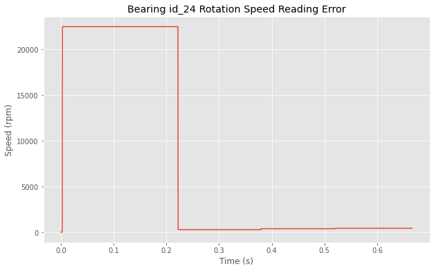
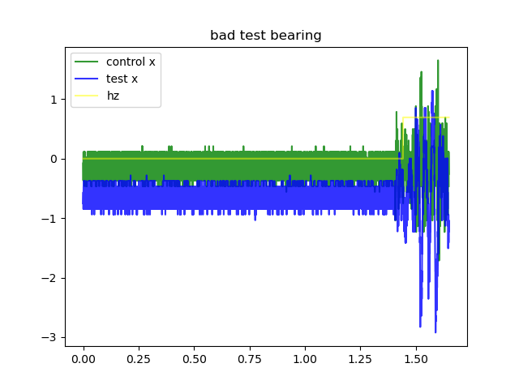
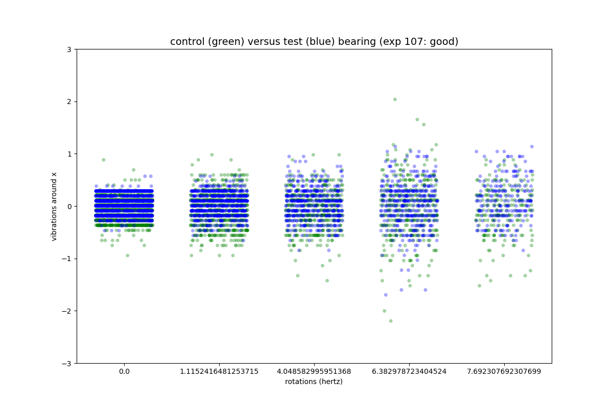
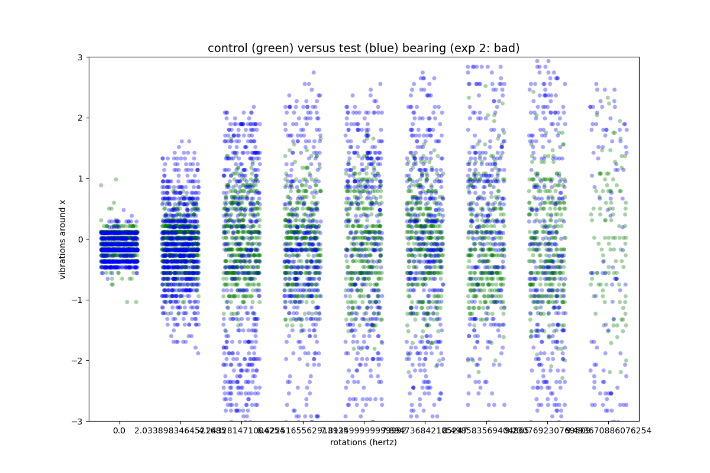
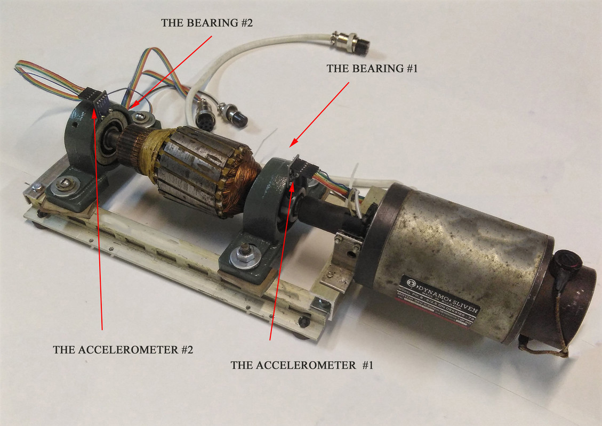
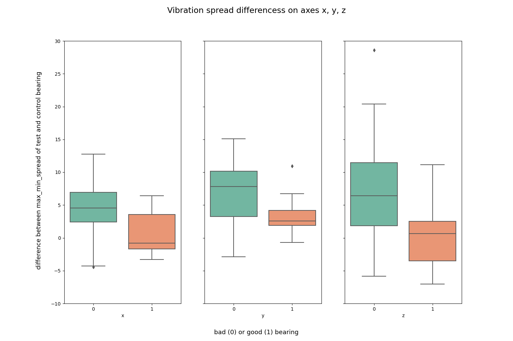
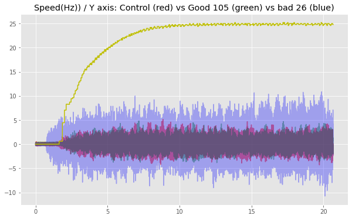

## Challenge Bearing Classification

# Description
  This was an assignment we received during our training at BeCode.  
  The main goal was to get used to Machine Learning, specifically using classification algorithms.   
  For this we used a database from <a href="https://www.kaggle.com/isaienkov/bearing-classification" target="_blank">Kaggle</a>, on testing bearings.  
  Our job was to predict if a bearing was defective or not, with an accuracy as high as possible.
  
  
# Installation
## Python version
* Python 3.9

## Databases
Github has a 100MB file limit, so the files can't be found in this repository.  
Below however, you can find the links to both files.
* <a href="https://www.kaggle.com/isaienkov/bearing-classification?select=bearing_classes.csv" target="_blank">Target</a>
* <a href="https://www.kaggle.com/isaienkov/bearing-classification?select=bearing_signals.csv" target="_blank">Features</a>

## Packages used
* pandas
* numpy
* matplotlib.pyplot
* seaborn
* sklearn

# Usage
| File                        | Description                                                     |
|-----------------------------|-----------------------------------------------------------------|
| main.py                   | File containing Python code.     Used for cleaning and feature engineering the data |
| plots.py                    | File containing Python code.    Used for making some explanatory plots for this README. |
| utils/model.py              | File containing Python code, using ML - Random Forest.    Fitting our data to the model and use to it make predictions. |
| utils/manipulate_dataset.py | File containing Python code. Functions made for ease of use in a team enviroment. |
| utils/plotting.py           | File containing Python code. Used for getting to know the data. Made plots to find correlations between features. |
| csv_output                  | Folder containing some of the csv-files we used for our coding. Not all of our outputted files are in here,    since Github has a file limit of 100MB. |
| visuals                     | Folder containing plots we deemed interesting and helped us gain    insights on the data. |

# Feature engineering
| Column name of feature | Change made                  | Reason                                                                                        |
|------------------------|------------------------------|-----------------------------------------------------------------------------------------------|
| timestamp              | Only keeping rows above 0,25 | We found some outliers where the "rpm" and "hz" values spiked in the first parts of the test.   With the use of plotting, we discovered a cut off point. |

| Column name of feature | Change made                             | Reason                                                                                                                        |
|------------------------|-----------------------------------------|-------------------------------------------------------------------------------------------------------------------------------|
| timestamp              | Only keeping rows equal to or below 1,5 | We found that the biggest differences between it being a bad or good bearing,  could be found in the first parts of the test.   With the use of plotting, we discovered a cut off point. |

| Column names of feature | Changes made                                                            | Reason                                                                                                      |
|-------------------------|-------------------------------------------------------------------------|-------------------------------------------------------------------------------------------------------------|
| a1_x   a1_y   a1_z   a2_x   a2_y   a2_z | For every "experiment_id", took the mean of every column mentioned.  For every row, changed the value in every column mentioned to its mean. | The model had an easier time of fitting and was still able to make accurate predictions with these changes. |

# Visuals
## Machine used to gather the data on bearings

## Plot showing the min-max-difference of every axis, on every bearing.

## Plot that gave us the idea to look into the first seconds.

# Contributors
| Name                  | Github                                 |
|-----------------------|----------------------------------------|
| Patrick Brunswyck        | https://github.com/brunswyck               |
| Jose Roldan | https://github.com/Roldan87 |
| Matthew Samyn         | https://github.com/matthew-samyn       |
| Maarten Van den Bulcke           | https://github.com/MaartenVdBulcke       |

# Timeline
29/07/2021 - 03/08/2021
