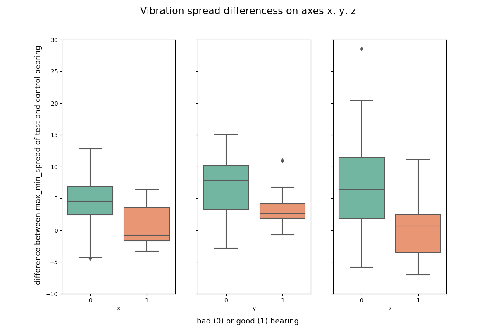

## Challenge Bearing Classification

# Description
  This was an assignment we received during our training at BeCode.  
  The main goal was to get used to Machine Learning, specifically using classification algorithms.   
  For this we used a database from <a href="https://www.kaggle.com/isaienkov/bearing-classification" target="_blank">Kaggle</a>, on testing bearings.  
  Our job was to predict if a bearing was defective or not, with an accuracy as high as possible.
  
  
# Installation
## Python version
* Python 3.9

## Databases
* <a href="https://www.kaggle.com/isaienkov/bearing-classification?select=bearing_classes.csv" target="_blank">Target</a>
* <a href="https://www.kaggle.com/isaienkov/bearing-classification?select=bearing_signals.csv" target="_blank">Features</a>

## Packages used
* pandas
* numpy
* matplotlib.pyplot
* seaborn
* sklearn

# Usage
| File                           | Description                                                                             |
|--------------------------------|-----------------------------------------------------------------------------------------|
| vibration_spread_comparison.py | File containing Python code.     Feature engineering, calculating min-max-relationship on every axis, for every bearing. |

# Visuals
## Machine used to gather the data on bearings

## Plot showing the min-max-difference of every axis, on every bearing.

# Contributors
| Name                  | Github                                 |
|-----------------------|----------------------------------------|
| Patrick Brunswyck        | https://github.com/brunswyck               |
| Jose Roldan | https://github.com/Roldan87 |
| Matthew Samyn         | https://github.com/matthew-samyn       |
| Maarten Van den Bulcke           | https://github.com/MaartenVdBulcke       |

# Timeline
29/07/2021 - 03/08/2021
